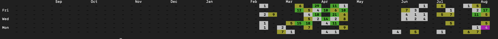

# GitStats

Ever wanted to see ALL your git commits in one place? Like, even the ones from your private repos and work stuff all while being OFFLINE? That's exactly what GitStats does! It scans your local repos you've personally added and shows you a neat contribution graph, just like the one on GitHub, but in your terminal.

Best part? It's written in Go! 





## Installation

Just run:

```bash
# Clone this bad boy
git clone https://github.com/owenHochwald/git_contribution_cli.git

# Jump into the folder
cd git_contribution_cli

# Install it (might need sudo)
make install
```

## How to Use It

Here's the fun part! GitStats is super simple to use:

```bash
# Add a folder with git repos (it'll scan recursively)
gitstats -add ~/code/my-awesome-projects

# See your contributions (use your actual email)
gitstats -email you@example.com

# See what repos you're tracking
gitstats -list

# Need help? Got you covered!
gitstats -help
```

## Features

- Recursively finds all git repos in a folder
- Shows your contributions in a neat graph
- Color-coded commit intensity
- Full year of history
- Works with any git repo, not just GitHub ones


## Contributing

1. Open an issue
2. Submit a PR
3. Fork it and go wild!

